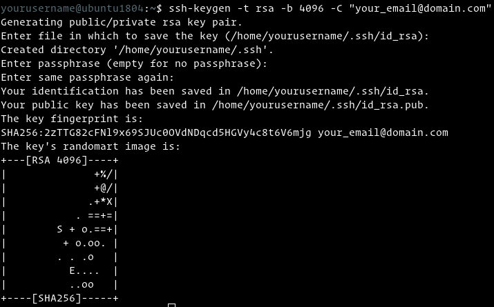

# SSH Key Setup and Usage Tutorial

Author: methylDragon  
Learn how to setup SSH keys!    

------

## Introduction

Tutorial notes: https://linuxize.com/post/how-to-set-up-ssh-keys-on-ubuntu-1804/


**ELI5**

> You've got 2 sets of numbers that are mathematically-related, and you have a special algorithm that's also mathematically-related to the numbers. The algorithm takes one of those numbers, and another number representing the message that you want to encrypt...and the output is 1 more number, the same length as the message.
>
> One of the sets of numbers represents your "public key", and one represents your "private key". If you encrypt with your public key, then only your private key can decrypt it. If you encrypt with your private key, then only your public key can decrypt it. If someone asks for your public key, you give it to them, but you keep the private one secret.
>
> You have a few operations that this allows for, and the only difference is which key you're using as the input for the algorithm.
>
> - Sign: Your private key + a message = signed message
> - Verify: Someone else's public key + a signed message = verification that the person possesses the private key that you used to decrypt the message
> - Encrypt: Someone's public key + message = Message encrypted to that person
> - Decrypt: Encrypted message + your private key = a decrypted message, if it was encrypted with your public key.
>
> Signing something means that anyone can decrypt it, but they can verify that you're the one that sent it. Encrypting something means that only the intended recipient can decrypt it.
>
> https://www.reddit.com/r/learnprogramming/comments/1enupy/explain_ssh_keys_and_validation_like_im_five/

Basically, it's a better way to login than using passwords! 

- You won't need to login on an SSH client with a password if you use a key based system
- You also won't have any risk of password compromises as long as you don't send someone your private key!

Great! Let's learn how to set them up!


## Setting Up SSH Key Login

### 1. Check if you have an existing SSH key

If you get a match, you have one! If not, you can just use them! Or if you want, you can generate a new one!

```shell
$ ls -l ~/.ssh/id_*.pub
```


### 2. Generate a new public-private key pair

This generates a 4096 bit key pair with your email address as a comment

```shell
$ ssh-keygen -t rsa -b 4096 -C "your_email@domain.com"

# Press enter to save them in the default location, or type a custom file name for them

# You'll then be prompted to set a passphrase for extra security. Do not set one if you intend to use the key in automated software.
# If you set no passphrase, ensure no one takes your private keyfile! If you do that they can impersonate you!
```

Passphrase notes: https://serverfault.com/questions/142959/is-it-okay-to-use-a-ssh-key-with-an-empty-passphrase

You should see this:




**If you saved it as the default file:**

**id_rsa** : This is your private key! **DO NOT SHARE THIS. PEOPLE CAN USE THIS TO IMPERSONATE YOU.**

**id_rsa.pub** : This is your public key! You may upload this to other places to let them verify your identity!


### 3. Verify that your key was generated

```shell
$ ls ~/.ssh/id_*
```


### 4. Upload your public key to places you want to be able to SSH into via SSH keys

This will append your public key (specifically `~/.ssh/id_rsa.pub`) to the remote server's `~/.ssh/authorized_keys`

```shell
$ ssh-copy-id remoteusername@server_ip_address

# Then key in the remote server's password
```


**Now you should be able to SSH into the remote server (even if it's password protected) using your SSH keys alone!**


### 5. Optional: Disable SSHing in via password

If you do this, the only way to login to a server is to use an SSH key!

```shell
$ ssh remoteusername@server_ip_address
$ sudo nano /etc/ssh/sshd_config
```

Edit that file and modify these lines to this:

```
PasswordAuthentication no
ChallengeResponseAuthentication no
UsePAM no
```

Then restart the SSH service!

```shell
$ sudo systemctl restart ssh
```


### Using Multiple SSH Keys

If you have multiple SSH keys, you can still use them!

In fact, **you can even use multiple SSH keys and try them iteratively!**

**In the config file in ~/.ssh/config, add these lines:**

```python
IdentityFile ~/.ssh/id_rsa
IdentityFile ~/.ssh/id_rsa_1
IdentityFile ~/.ssh/id_rsa_2
IdentityFile ~/.ssh/id_rsa_3

.
.
.
```


## Setting Up SSH Password

Use this to change the sudo password

```shell
$ passwd
```

You may have to be root to do it, so either run

```shell
$ sudo -i
$ passwd
```

Or

```shell
$ sudo passwd root
```


## Adding New User Accounts

Add users!

```shell
$ sudo -i # Become root
$ adduser <username>
$ usermod -aG sudo <username>
```

Test the user account

```shell
$ su - <username>
```


## Convenience: Setting up SSH Aliases

You might want to set up SSH aliases. You can do so by setting an SSH config file!

```shell
$ sudo touch ~/.ssh/config # If it doesn't exist
$ sudo nano ~/.ssh/config
```

Then place your aliases in!

```
Host ALIAS
    Port PORT_NO
    User USERNAME
    HostName IP
```

You can also specify specific SSH keys to use for a host alias

```python
Host ALIAS
    Port PORT_NO
    User USERNAME
    HostName IP
    IdentityFile ~/.ssh/id_rsa_file
    PreferredAuthentications publickey
```


## I can't use SSH!

You need to remember to set it up on the remote server and your local server!

```shell
$ sudo apt-get install openssh-server
```


```
                            .     .
                         .  |\-^-/|  .    
                        /| } O.=.O { |\
```

​    

------

 [.png)](https://www.buymeacoffee.com/methylDragon)